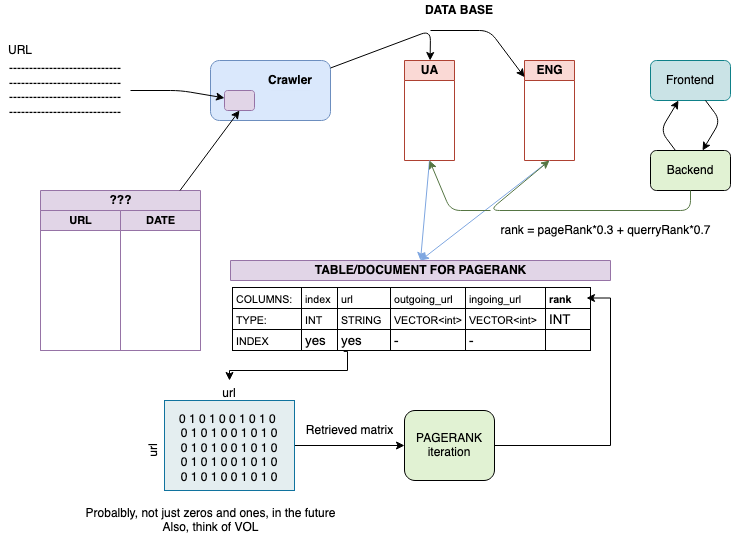

# Mini Google
Course project for the Architecture of Computer Systems course.

## Overview:


We are working on multiple components of the web crawler at the same time:

* [Website](./website)
* [Database in PostgreSQL](./database)
* Two crawlers (one in [Python](./python-crawler) and one in [Rust](./rust-crawler) )

Each component is intended to run as a separate Docker container, for us
to be able to freely mix them in different amounts and on different computers/servers.

Example docker containers for [Rust](./rust-docker) and [Python](./python-docker) are also
temporarily available here.

Progress can be tracked [over here](./PROGRESS.md).

## Usage:

Launch each container independently with instructions in respective directories,
or launch all of them together:
```
# WARNING!!!! Rust builds a static binary and it takes a lot of CPU time
# do so, I am going to try to cache it somehow or switch to running on
# a non-scratch image since we already do this with Python. Have no idea.
# Currently Rust crawler is commented in the docker-compose.yml :)
docker-compose build

docker-compose up
```

## Prerequisites:

## Credits:
* [Vyacheslav Shevchuk](https://github.com/OldFrostDragon)
* [Andriy Sultanov](https://github.com/LastGenius-edu)
* [Maksym Kuzyshyn](https://github.com/maxymkuz)
* [Maksym Protsyk](https://github.com/maksprotsyk)
* [Daria Omelkina](https://github.com/dariaomelkina)

## License:
[MIT License](https://github.com/maxymkuz/mini_google/blob/main/LICENSE)
