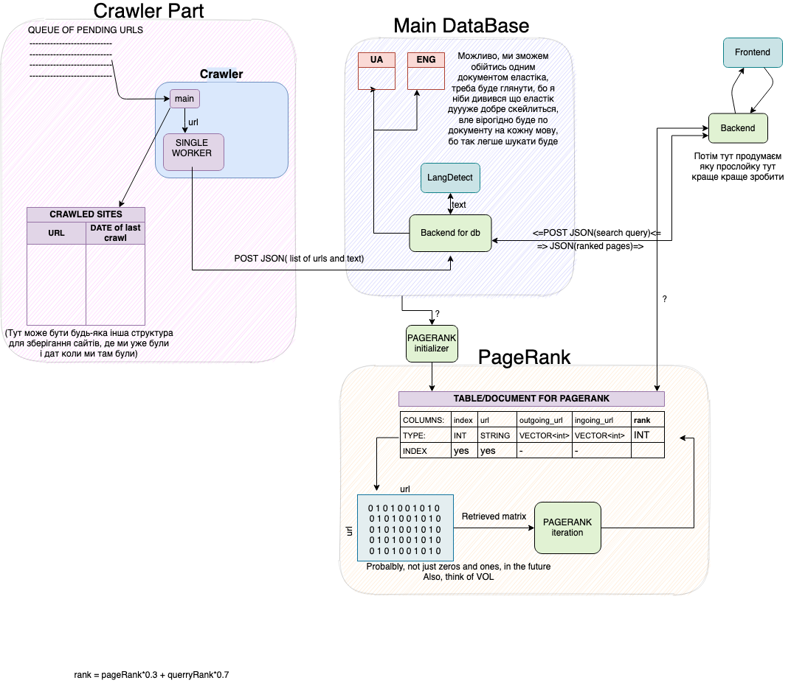

# Mini Google
Course project for the Architecture of Computer Systems course.

## Overview:


We are working on multiple components of the web crawler at the same time:

* [Website backend](./website)
* *(WIP) Database is being transferred to ElasticSearch*
* Two crawlers (one in [Python](./python_crawler), and one in [Rust](./rust_crawler) )
* Language detection backend in [Rust](./rust_crawler_backend).

Each component is intended to run as a separate Docker container, for us
to be able to freely mix them in different amounts and on different computers/servers.

Progress can be tracked [over here](./PROGRESS.md).

## Usage:

Launch each container independently with instructions in respective directories,
or launch all of them together:
```
# Rust takes some time to download and compile all of the dependencies since it
# produces static binaries, so be aware! We are figuring out a way to fix this.
docker-compose build

docker-compose up
```

## Prerequisites:

## Credits:
* [Vyacheslav Shevchuk](https://github.com/OldFrostDragon)
* [Andriy Sultanov](https://github.com/LastGenius-edu)
* [Maksym Kuzyshyn](https://github.com/maxymkuz)
* [Maksym Protsyk](https://github.com/maksprotsyk)
* [Daria Omelkina](https://github.com/dariaomelkina)

## License:
[MIT License](https://github.com/maxymkuz/mini_google/blob/main/LICENSE)
