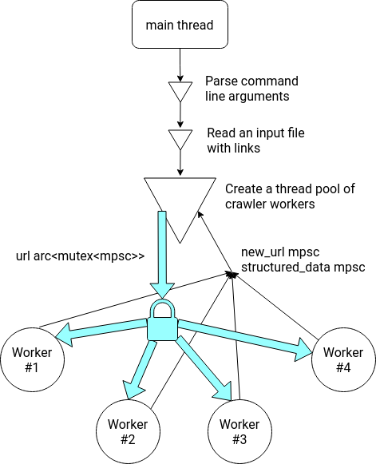

**Parallel crawler for structured data in Rust**

Docker image is just 14mb thanks to the static compilation and scratch image

## Usage

Just run it and it will print out structured data found on the page:

```bash
# A quick test build of the rust executable
# The CLI executable displays its progress
# 'l' chooses a maximum number of webpages to crawl (default is 1024)
# 'r' chooses a maximum number of repeats for failed pages (default is 3)
cargo run --release -- -i file.txt -o out.txt -t 8 -l 300 -r 5

# A help page with CLI parameters' descriptions
cargo run -- --help

# Build and run a Docker image
# This build is relatively slow and produces a static executable
# The progress is not displayed correctly in the docker container
./build.sh
docker run --rm lastgenius/rust-crawler -i file.txt -o out.txt -t 8
```

## Architecture

This is a rough outline of how this crawler works. I will try to update it in the
case of any major changes, but it's always better to check out the module's documentation
itself in case you need to understand everything better and on a deeper level. 

You can build the documentation locally with `cargo doc --open`, and choosing the
crate from the menu on the left.

Overall the program works like this, with a single main thread starting off, reading user input
from the command line, reading an input file with webpage links, and then creating a thread
pool of workers, establishing several MPSC (Multiple Producers Single Consumer) channels between
the main thread and threads in the pool:

* **URL channel** - through which the main thread sends URLs to crawl to the thread pool. Has to
be protected by a mutex (essentially is a queue with a lock).
* **New URL channel** - works as intended, with threads in the pool sending new URLs which they
acquire during the crawl.
* **Structured data channel** - works as intended, with threads in the pool sending structured
data acquired on a page, if any.



Each worker is just an asynchronous single-thread `tokio` runtime that tries to get a vector
of new URLs to crawl through the URL channel, and then asynchonously shoots off requests and gets
data, which is then parsed and sent back to the main thread.

If URLs error out, the main thread is going to repeat this URL a few times,
waiting for exponentially more time between attempts, before discarding the URL altogether.

## Resources to quickly pick up what's going on here

Some useful resources on Rust in general, as well as on concurrency and web:
* [A pretty useful tutorial](https://rolisz.ro/2020/03/01/web-crawler-in-rust/)
* Rust Cookbook's examples:
    * [Concurrency](https://rust-lang-nursery.github.io/rust-cookbook/concurrency.html)
    * [Database](https://rust-lang-nursery.github.io/rust-cookbook/database.html)
    * [Networking](https://rust-lang-nursery.github.io/rust-cookbook/net.html)
    * [Web](https://rust-lang-nursery.github.io/rust-cookbook/web.html)
* [Tokio tutorial](https://tokio.rs/tokio/tutorial/)
* [std::thread documentation](https://doc.rust-lang.org/std/thread/index.html)
* [std::sync::mpsc documentation](https://doc.rust-lang.org/std/sync/mpsc/index.html)
* [Async book](https://rust-lang.github.io/async-book/)

I'm using these libraries (Rust calls them crates):
* [select.rs](https://github.com/utkarshkukreti/select.rs)
* [reqwest](https://github.com/seanmonstar/reqwest)

And also these ones for nice debug print and argument parsing:
* [clap](https://docs.rs/clap/2.33.3/clap/)
* [indicatif](https://docs.rs/indicatif/0.15.0/indicatif/)
