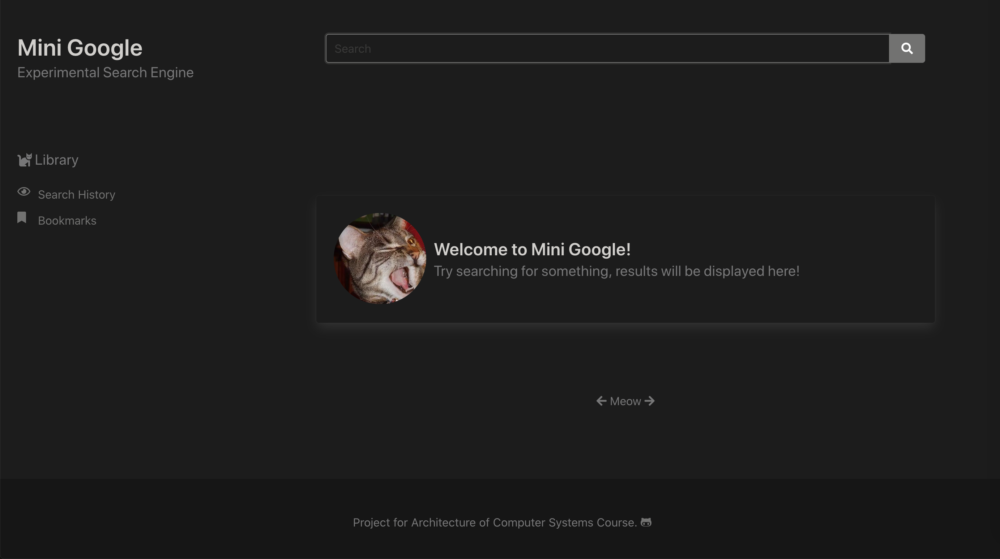
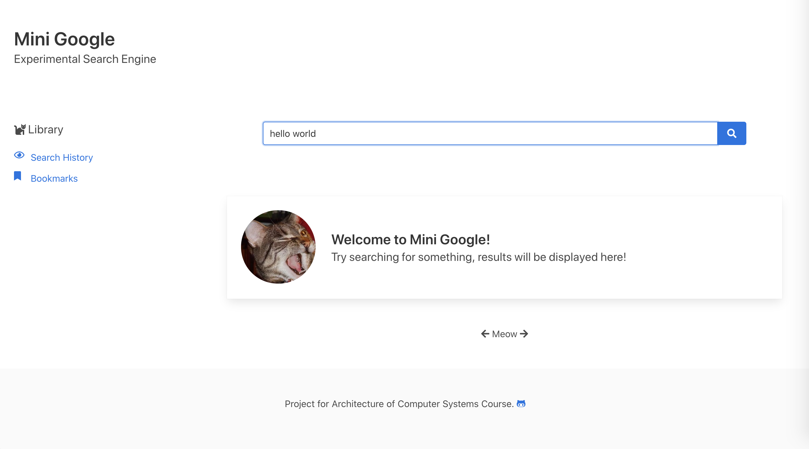
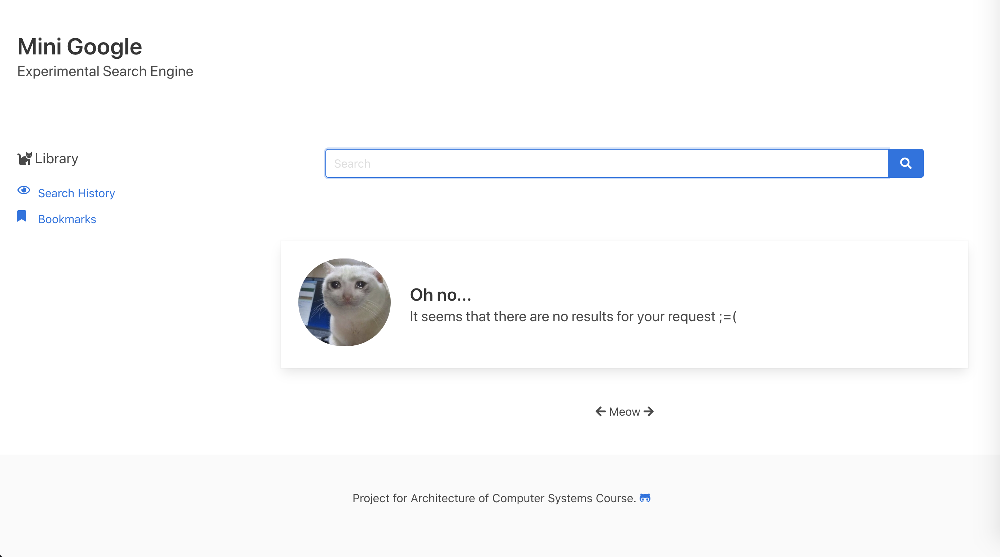
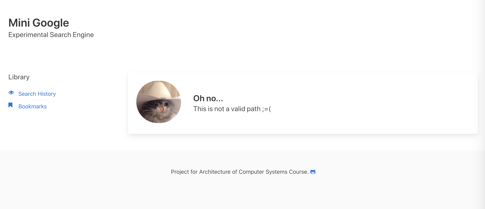

### Mini Google Website
Web application written in Rust + using [Bulma](https://github.com/jgthms/bulma) CSS.

## Details:
Currently backend works with json files of such structure:
```
[
  {
    "title": "website title",
    "url": "website url",
    "description": "short description"
  },
  .
  .
  .
]
```

Webapp uses Rust Rocket framework and Tera templates.

## Usage:

Without Docker:
```bash
# Set Rust toolchain in this project to nightly
rustup install nightly-2021-02-13
cargo +nightly-2021-02-13 build --release

# Run project
cargo run
```
With Docker:
```
# Build docker container
./build.srustup install nightly-2021-02-13
h
# Run website on 0.0.0.0:5000
./run.sh

# When (if) you want to stop:
./stop.sh
```


Here is how main page looks like, when dark theme is used:


Here with light theme:




